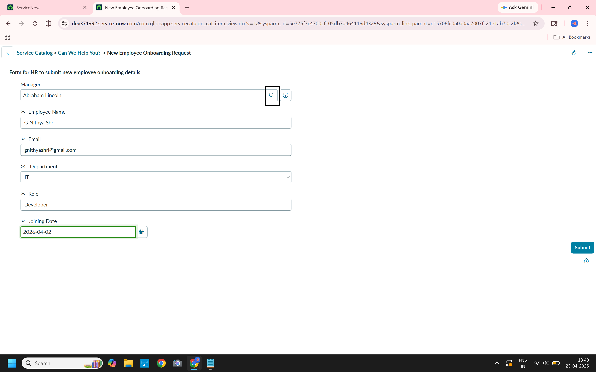

# 🚀 ServiceNow Employee Onboarding Automation

## 📌 Project Overview
This project replaces fragmented manual hiring processes (emails/spreadsheets) with a **unified automation engine** within ServiceNow. It features a structured intake form, dynamic manager approval routing, and automated fulfillment tasking.

---

## 🛠️ Tech Stack & Tools

| Area | Technology |
| :--- | :--- |
| **Platform** | ServiceNow (Vancouver/Washington) |
| **Development** | App Engine Studio (AES) |
| **Automation** | Flow Designer |
| **User Interface** | Service Catalog & Record Producers |
| **Version Control** | GitHub (XML-based CI/CD) |

---

## 🏗️ Technical Architecture

### 1. User Experience (Record Producer)
HR specialists utilize a custom-built **Record Producer** to initiate onboarding. 
*   **Feature:** 1:1 Variable-to-Field mapping for data integrity.
*   **Enhancement:** Reference-type mapping for Managers to link directly to the `sys_user` table.

> 

### 2. Data Model (Custom Table)
A standalone table acts as the system of record. 
*   **Field Optimization:** The `Employee Name` field is set as the **Display Value**, ensuring clean audit trails in the Approval Engine.

> **[INSERT SCREENSHOT: Data Table]**

### 3. Logic Engine (Flow Designer)
The "brain" of the application handles the lifecycle:
*   **Approval Routing:** Dynamic triggers based on the Requesting Manager.
*   **Departmental Branching:** `If/Else` logic to route tasks specifically to **IT, HR, or Finance**.
*   **State Sync:** Flow "Waits for Condition" to ensure parent records close only when fulfillment is 100% finished.

> **[INSERT SCREENSHOT: Flow Logic Diagram]**

---

## ✅ Proof of Execution
### 🚦 Workflow Trace
The execution trace below confirms successful approval routing and conditional task generation with zero errors.

> **[INSERT SCREENSHOT: Flow Execution Trace with Green Checkmarks]**

### 🏁 Final Result
End-to-end completion: The request record is successfully marked as **Completed** upon closure of the final `sc_task`.

> **[INSERT SCREENSHOT: Success Record showing Status: Completed]**

---

## 🔧 Challenges & Solutions
*   **The "Deadlock" Fix:** Resolved a critical flow stall by correctly configuring the **Display Toggle** on the backend table, allowing the Approval Engine to recognize the reference record.
*   **Data Type Alignment:** Standardized variable types to match backend schema, preventing "undefined" values during the handoff from UI to Table.

---

## 📈 Roadmap (Phase 2)
- [ ] **Automated Provisioning:** Automated `sys_user` creation via Flow actions.
- [ ] **Notification Engine:** Personalized welcome emails for new hires.
- [ ] **Dynamic UI:** UI Policies to show/hide fields based on the selected Department.
